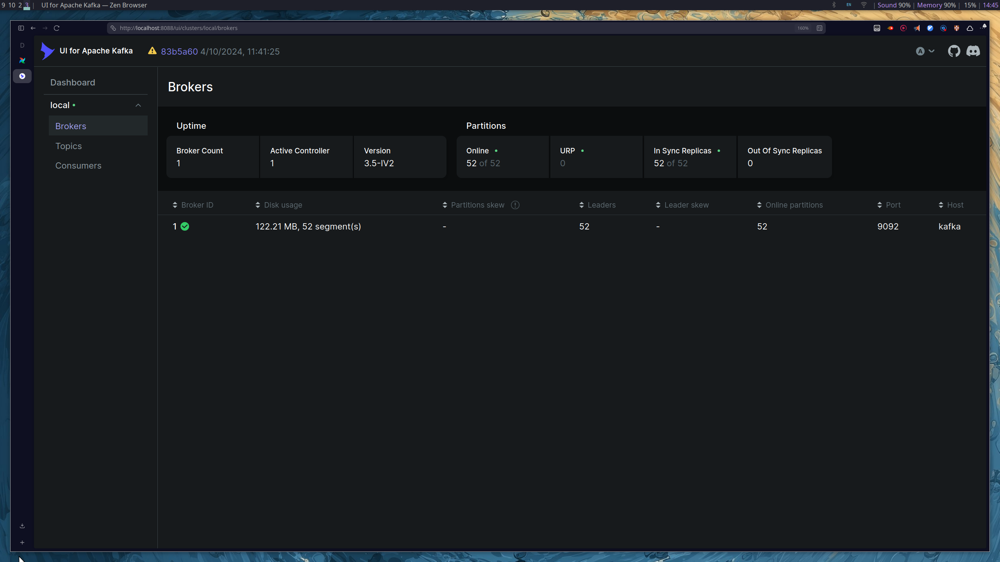
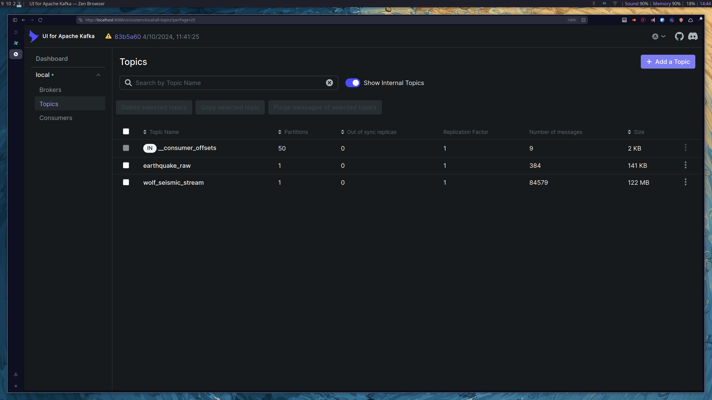

# Kafka Data Pipeline Documentation

## Overview

Apache Kafka serves as the real-time ingestion backbone of this seismic data platform. It connects external WebSocket seismic sources to Spark Structured Streaming consumers and ultimately to the Delta Lake storage layer.

Kafka provides:

- Decoupled ingestion and processing
- Buffering for high-velocity data streams
- Partition-based ordering guarantees
- Replay capability
- Fault-tolerant event delivery
- Scalable streaming architecture

The system ingests:

- Global earthquake events (EMSC SeismicPortal)
- Wolf seismic station measurements (Japan)

---

## Kafka Cluster Architecture

### Deployment Model

Kafka runs in Docker with:

- Zookeeper dependency
- Single broker configuration
- Dual network listeners

### Internal Access (Docker Services)

Used by Spark, Airflow, and other containerized services:

```

kafka:9092

```

### External Access (Local Development)

Used by local producers and tools:

```

localhost:9098

```

This separation ensures clean service isolation and avoids port conflicts.

---

## Monitoring

The Kafka broker is configured with JMX exporter integration for Prometheus monitoring.

This enables visibility into:

- Broker health
- Topic throughput
- Consumer lag
- Retention behavior
- Operational metrics



---

## Topics

### 1. earthquake_raw

**Purpose:**  
Stores real-time global earthquake events from the SeismicPortal WebSocket feed.

**Created by:**  
`kafka-topics-earthquakes.sh`

**Configuration:**

- Partitions: 3
- Replication factor: 1 (development)
- Retention: 168 hours (broker configuration)

**Data Characteristics:**

- JSON messages
- Nested structure
- Contains unique event ID (`unid`)
- Used by Spark for streaming ingestion into Delta Lake

---

### 2. wolf_seismic_stream

**Purpose:**  
Stores high-frequency seismic station measurements from the Wolf network.

**Created by:**  
`Kafka-topic-wolf_seismic_stream.sh`

**Configuration:**

- Partitions: 3
- Replication factor: 1 (development)

**Data Characteristics:**

- Real-time station measurements
- Contains `Station` identifier
- Includes ground motion metrics (PGA, PGV, etc.)
- Heartbeat messages filtered before publishing



---

## Producers

Two independent WebSocket producers publish data into Kafka.

Both are designed for reliability, validation, and observability.

---

### Earthquake Producer

**Source:**  
SeismicPortal (EMSC) WebSocket feed

**Workflow:**

1. Establish persistent WebSocket connection.
2. Continuously receive earthquake events.
3. Parse JSON messages.
4. Validate required fields:
   - `unid`
   - `time`
   - `lat`
   - `lon`
   - `mag`
5. Use `unid` as Kafka partition key.
6. Publish to `earthquake_raw`.
7. Automatically reconnect if connection fails.

**Reliability Settings:**

- Idempotence enabled
- `acks='all'`
- Retries enabled
- Gzip compression
- Ordered delivery per key
- JSON serialization

**Guarantees:**

- Exactly-once delivery semantics
- No duplicate earthquake events
- Partition-level ordering by event ID

**Monitoring:**

Exposes Prometheus metrics for:

- Messages sent
- Messages failed
- Validation errors
- JSON parsing errors
- WebSocket connection state

---

### Wolf Seismic Producer

**Source:**  
Wolf Seismic Network (Japan)

**Workflow:**

1. Connect to Wolf WebSocket feed.
2. Receive continuous station measurements.
3. Filter heartbeat messages.
4. Validate:
   - `latitude`
   - `longitude`
   - `Station`
5. Use `Station` as Kafka partition key.
6. Publish to `wolf_seismic_stream`.
7. Automatically reconnect on failure.

**Reliability Settings:**

- Idempotent producer
- `acks='all'`
- Retries enabled
- Low-latency configuration

**Partition Strategy:**

Using `Station` as key ensures:

- Ordered data per seismic station
- Consistent downstream time-series processing

**Monitoring:**

Exposes Prometheus metrics for:

- Messages sent
- Messages failed
- Validation errors
- Connection errors
- WebSocket state

---

## Data Flow

```

External WebSocket Sources
↓
Kafka Producers
↓
Kafka Topics
↓
Spark Structured Streaming Consumers
↓
Delta Lake Tables

```

Kafka acts as the event backbone, decoupling ingestion from processing and enabling scalable, fault-tolerant streaming.

---

## Integration with Spark

Spark consumers:

- Read from earliest offsets
- Parse JSON using predefined schemas
- Apply data validation
- Write to Delta Lake in append mode
- Use checkpointing for exactly-once processing

This ensures:

- No data loss
- No duplicate records
- Recoverable streaming jobs

---

## Role in the System

Kafka provides:

- Real-time event buffering
- Backpressure handling
- Partition-based ordering
- Replay capability
- Reliability between ingestion and processing layers
- Scalable streaming infrastructure

It is the central communication layer of the seismic pipeline.

