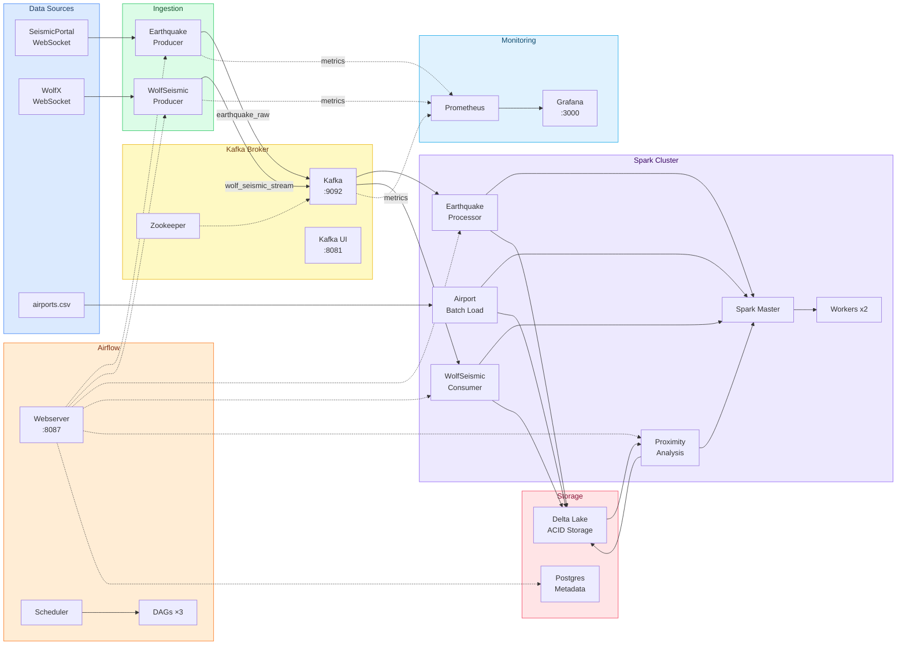

# Seismic Data Pipeline: Real-Time & Batch Processing Platform

An enterprise-grade, fault-tolerant, and highly available data pipeline designed to ingest, process, and analyze global seismic events and high-frequency station measurements in real time, joining them with static infrastructure data to supply actionable geospatial insights.

---

## Table of Contents

- [Project Overview](#project-overview)
- [Motivation & Core Problem Solved](#motivation--core-problem-solved)
- [System Architecture](#system-architecture)
- [End-to-End Data Flow](#end-to-end-data-flow)
- [Technologies & Design Decisions](#technologies--design-decisions)
- [Component Breakdown](#component-breakdown)
  - [Pipeline Orchestration & Initialization (Airflow)](#1-pipeline-orchestration--initialization-airflow)
  - [Real-Time Data Ingestion (Kafka Producers)](#2-real-time-data-ingestion-kafka-producers)
  - [Stream Processing (Spark Structured Streaming)](#3-stream-processing-spark-structured-streaming)
  - [Proximity Analysis (Stream-Static Join)](#4-proximity-analysis-stream-static-join)
  - [Batch Processing (Static Reference Data)](#5-batch-processing-static-reference-data)
  - [Infrastructure Verification & Validation](#6-infrastructure-verification--validation)
  - [Metrics Collection & Observability](#7-metrics-collection--observability)
- [Setup & Environment Configuration](#setup--environment-configuration)
- [Execution Workflow](#execution-workflow)
  - [Automated Pipeline Execution](#automated-pipeline-execution)
  - [Manual Component Execution](#manual-component-execution)
- [Validation & Testing](#validation--testing)
- [Resilience & Failure Handling](#resilience--failure-handling)
- [Logging & Data Validation Strategy](#logging--data-validation-strategy)
- [Continuous Integration (CI/CD)](#continuous-integration-cicd)
---

## Project Overview

The **Seismic Data Pipeline** is a unified analytics platform engineered to capture live earthquake feeds and seismic waveforms from global web socket APIs. The streaming data is parsed, validated, and continuously appended to Delta Lake. Concurrently, batch datasets (e.g., global airport locations) are ingested. A hybrid streaming-batch analytics engine continuously cross-references seismic activities against critical infrastructure, computing distances (via the Haversine formula) to actively detect proximity threats (earthquakes occurring near airports).

##  Motivation & Core Problem Solved

**The Problem:**
Handling unbounded, high-velocity streams of raw JSON data containing deeply nested schemas, intermittent availability, and geospatial anomalies can be challenging. Furthermore, joining volatile streaming data with static reference data—while guaranteeing data consistency, preventing duplicates, and persisting historical audit trails—requires robust distributed systems.

**The Solution:**
This pipeline was built to demonstrate a production-aligned setup that achieves:
- **Exactly-once processing semantics** to omit duplicates in chaotic API streams.
- **Fail-safe, self-healing orchestration** capable of recovering from network outages, dead executor nodes, or broker disconnects.
- **ACID-compliant versioned storage** using Delta Lake, allowing engineers to query point-in-time data safely while writers continuously append to it.

---

##  System Architecture

The ecosystem relies entirely on decoupled containerized services.

https://github.com/user-attachments/assets/8059069a-eae0-4ee6-89d4-153ba68814c8

The pipeline operates in 5 horizontal layers:
1. **Source/Ingestion Layer:** Python Daemons capturing WebSocket signals.
2. **Message Broker Layer:** Apache Kafka clustered via Zookeeper.
3. **Compute/Processing Layer:** Apache Spark cluster executing Structured Streaming and Batch workloads.
4. **Storage Layer:** Local Delta Lake volume mimicking an S3/HDFS setup.
5. **Observability & Orchestration Layer:** Apache Airflow managing job lifecycles paired with Prometheus & Grafana tracking metrics.

---

## End-to-End Data Flow

1. **Ingestion (`Kafka/`):** Dedicated Python producer scripts connect to the SeismicPortal.eu WebSocket and the WolfX seismic API. They buffer raw JSON payloads and publish them asynchronously to Kafka topics (`earthquake_raw`, `wolf_seismic_stream`).
2. **Stream Processing (`spark-consumers/`):** Spark Streaming applications subscribe to the Kafka topics. They deserialize the values, enforce a rigid data schema, flatten nested geometries, drop bad coordinates, perform distinct ID deduplication, and append the sanitized records into respective Delta tables.
3. **Batch Ingestion:** An Airflow-triggered batch job (`airport_batch_to_delta.py`) reads a static `airports.csv` from the host filesystem, drops invalid entries, and overwrites the active `airports` Delta table.
4. **Insight Generation (Stream-Static Join):** The `proximity_analyzer.py` stream reads the live `earthquakes` Delta table and joins it in real-time with the static `airports` Delta table using a Broadcast join. It calculates the Haversine distance and outputs threat alerts (e.g., < 20,000 km triggers) into the `proximity_events` Delta table.
5. **Monitoring:** Prometheus continuously scrapes the Python producers, Kafka's JMX exporter, and the Spark cluster to render a live health dashboard on Grafana.


#### Mermaid for more details



---

## Technologies & Design Decisions

| Component | Technology | Rationale |
| :--- | :--- | :--- |
| **Stream Processing** | **Apache Spark 3.5.0** | Industry standard for unified batch & streaming. Selected for Structured Streaming's built-in checkpointing and watermarking primitives. |
| **Message Broker** | **Apache Kafka 7.5.0** | Guarantees decoupled persistence and high throughput ingestion. Effectively buffers data so Spark ingestion never drops packets during bursts. |
| **Data Lake Storage** | **Delta Lake 3.0.0** | Extends Parquet with ACID transactions. Critical for preventing data corruption during simultaneous Read/Write operations and allowing schema evolution. |
| **Orchestration** | **Apache Airflow 2.7.3** | Pythonic DAG structure natively handles complex dependency graphs, scheduling, and infrastructure validation scripts via DockerOperator/BashOperator. |
| **Observability** | **Prometheus + Grafana** | Best-in-class multi-dimensional metrics scrape and dashboard visualization. Integrates smoothly with Kafka JMX and application-level metrics. |
| **Containerization**| **Docker Compose** | Guarantees deterministic, reproducible execution. Emulates a distributed multi-node environment locally. |

---

## Component Breakdown

Complete seismic data pipeline architecture tracing real-time data ingestion from external APIs through Kafka messaging, Spark stream processing, Delta Lake storage, geospatial analysis, and comprehensive monitoring.

### 1. Pipeline Orchestration & Initialization (Airflow)
The pipeline needs a reliable orchestration system to coordinate multiple moving parts: real-time data producers, stream processors, and analytics jobs. Without proper sequencing, components might start before dependencies are ready, leading to data loss or failures. The Airflow DAG solves this by ensuring the pipeline initializes in the correct order with appropriate delays between phases.

The pipeline verification DAG orchestrates a 7-step startup sequence:
- **Data Producers:** Launches earthquake and Wolf seismic producers connecting to external WebSocket APIs.
- **Producer Warm-up:** Waits 30 seconds for producers to establish connections and stream data.
- **Stream Consumers:** Starts Spark streaming jobs to consume from Kafka and write to Delta Lake.
- **Consumer Warm-up:** Waits 1 minute for stream processing to stabilize and data to flow to storage.
- **Proximity Analysis:** Launches the geospatial analyzer joining earthquake streams with airport data.
- **Analyzer Warm-up:** Waits 1 minute for proximity calculations to generate results.
- **Validation:** Runs automated checks to verify data integrity across all Delta tables.

The dependency chain prevents race conditions where downstream components might start before upstream data is available, maintaining safety in real-time streaming systems.

For more details about the pipeline orchestration: [dags_readme](dags/readme.md)

### 2. Real-Time Data Ingestion (Kafka Producers)
Capturing earthquake events in real-time from scientific sources (SeismicPortal.eu and WolfX) is essential. Because this data is ephemeral, the system must maintain persistent connections, handle network interruptions gracefully, and ensure no data loss during transmission to downstream systems.

- The **Earthquake Producer** connects to SeismicPortal.eu via WebSocket, entering an infinite loop to receive messages. It extracts critical metadata (magnitude, location, timestamp) and uses the event ID as a partition key to ensure proper Kafka topic distribution.
- The **Wolf Seismic Producer** accesses waveform data via a separate endpoint, parsing JSON and heartbeat messages while utilizing station codes as keys.
- Both producers implement automatic reconnection with exponential backoff handling network failures and expose Prometheus metrics for monitoring connection statuses and message throughput.

For more details about the producers: [producers_readme](Kafka/readme.md)

### 3. Stream Processing (Spark Structured Streaming)
Raw seismic data arrives continuously in complex, nested JSON formats, but downstream analysis requires clean, structured data. The Spark streaming jobs continuously transform these messy responses into reliable Delta Lake tables while maintaining exactly-once processing guarantees.

The streaming job initiates a Spark session with Delta Lake extensions and establishes a persistent Kafka connection. Each nested JSON message is parsed using a predefined schema. The transformation flattens the structure, extracting relevant coordinates, magnitudes, and timestamps into clean columns. The processed stream writes continuously to Delta Lake in append mode, utilizing checkpoint paths for fault tolerance and recovery.

For more details about the stream processing: [stream_processing_readme](spark-consumers/readme.md)

### 4. Proximity Analysis (Stream-Static Join)
When earthquakes occur, critical infrastructure like airports needs immediate risk assessments. The system calculates real-time proximity between seismic events and airports, enabling rapid decision-making for emergency response.

Operating as a continuous Spark job, the analyzer reads live earthquake data and static airport locations from Delta Lake tables. It performs a spatial cross-join, evaluating distances using the Haversine formula. The system filters for events within a 20,000km radius (a configurable threshold). Valid pairs are enriched with analysis timestamps and stored in a dedicated `proximity_events` Delta table. This architecture guarantees sub-minute latency from detection to calculation.

For more details about the proximity analysis: [proximity_analysis_readme](spark-consumers/readme.md)

### 5. Batch Processing (Static Reference Data)
To calculate proximity, the system requires reference airport coordinates. The batch job creates this foundational geospatial layer inside Delta Lake.

The batch processor reads `airports.csv` applying a predefined schema (ICAO codes, coordinates, metadata). It filters incomplete records (missing latitude/longitude/identifiers). 

Clean records are enriched with processing timestamps and appended to Delta Lake. Triggered via an Airflow DAG prior to the primary pipeline execution, it guarantees reference data availability before streaming data arrives.

For more details about the batch processing: [batch_processing_readme](spark-consumers/readme.md)

### 6. Infrastructure Verification & Validation
A distributed pipeline (Kafka, Spark, Zookeeper) can fail in multiple ways: brokers down, workers disconnected, or storage detached. Automated pre-flight health checks verify the stack before execution, averting cascading failures and resource waste.

- **Infrastructure Check:** Socket connections test Zookeeper, Kafka brokers, and Spark Master REST endpoints. It verifies the compute cluster by confirming registered Spark workers.
- **Data Integrity:** Reads Delta tables to ensure active data flow. It queries total row counts and isolates activity from the last 10 minutes to explicitly detect stale or empty table inputs.
- Structured inside an Airflow DAG, this ensures the system initiates *only* when the environment is healthy.

For more details about the scripts running: [scripts_readme](scripts/readme.md)

### 7. Metrics Collection & Observability
Continuous monitoring guarantees reliable data flows and immediately highlights disconnections, message failures, or bottlenecks.

Leveraging Prometheus and Grafana, the system achieves 24/7 observability:
- **Embedded Servers:** Each Python producer launches an HTTP server (ports 8000-8002) scraped every 10 seconds.
- **Connection Health & Throughput:** Gauges track WebSocket statuses (1=connected, 0=disconnected), whilst total messages explicitly highlight data stalls.
- **Error Tracking:** Distinguishes WebSocket disconnections from JSON parsing errors, identifying root causes swiftly.
- **Broader Infrastructure:** Observes Kafka via JMX (port 9404) and Spark/Docker primitives, guaranteeing comprehensive coverage.

For more details about the metrics collection: [metrics_collection_readme](prometheus/readme.md)


---

## Setup & Environment Configuration

### Prerequisites
- Docker (20.10+) & Docker Compose (2.20+)
- 8GB+ RAM available (Spark + Kafka + Airflow combined footprint)

### Configuration
1. **Clone the Project:**
   ```bash
   git clone <repository-url>
   cd Batch-Streaming-Data
   ```
2. **Environment Variables:**
   A template is provided. The pipeline depends intrinsically on `.env` configuration.
   ```bash
   cp .env.example .env
   ```
   *(Ensure ports, node configurations, and default secrets fit your host environment).*
3. **Initialize Network & Storage:**
   Ensure `chmod -R 777` on `./data`, `./logs`, `./local_logs`, and `./delta-lake` locally to allow container users (Airflow/Spark) to write freely.

---

## Execution Workflow

Start the cluster in detached mode. This brings up Postgres, Airflow components, Zookeeper, Kafka cluster, Kafka-UI, Spark Master/Workers, Prometheus, and Grafana.

```bash
docker-compose up -d
```
Wait `~2-3 minutes` for the orchestrated databases and JVM environments to report healthy status.

### Automated Pipeline Execution
The recommended method relies on Airflow to sequence the architecture start-up.
```bash
# Verify Infrastructure
docker exec airflow-scheduler airflow dags trigger seismic_infra_validation_dag

# Load Static Assets
docker exec airflow-scheduler airflow dags trigger airport_batch_dag

# Initiate Hand-off & Start Steaming Submissions
docker exec airflow-scheduler airflow dags trigger pipeline_verification_dag
```
You can visually monitor DAG success at **Airflow UI** (`http://localhost:8087` -> `admin`/`admin`).

### Manual Component Execution
Engineers debugging specific Spark metrics or Kafka offsets can manually orchestrate:
1. **Start Producers:**
   ```bash
   bash scripts/run_earthquake_producer.sh
   bash scripts/run_wolf_seismic_producer.sh
   ```
2. **Submit Spark Consumers:**
   ```bash
   bash scripts/submit_earthquake_consumer.sh
   ```
3. **Execute Geospatial Join:**
   ```bash
   bash scripts/run_proximity_analyzer.sh
   ```

---

## Validation & Testing

Validate your pipeline using built-in Spark assertion scripts.

**1. Automated Integrity Check:**
Runs a Spark job verifying distinct row counts and assuring recent delta log updates (last 10m).
```bash
docker exec -u root spark-master /opt/spark/bin/spark-submit \
    --packages io.delta:delta-spark_2.12:3.0.0 \
    --conf "spark.sql.extensions=io.delta.sql.DeltaSparkSessionExtension" \
    --conf "spark.sql.catalog.spark_catalog=org.apache.spark.sql.delta.catalog.DeltaCatalog" \
    /opt/spark/scripts/validate_delta_tables.py
```
**2. Query Delta Tables Locally:**
A developer utility to inspect the Delta ledger sequentially.
```bash
docker exec -u root -e VIEW_TABLE_PATH=/opt/delta-lake/tables/earthquakes spark-master \
  /opt/spark/bin/spark-submit --packages io.delta:delta-spark_2.12:3.0.0 \
  --master local[1] /opt/spark/consumers/view_table.py
```
**3. Real-Time Kafka Peek:**
Check the broker via Kafka-UI at `http://localhost:8088`.

---

## Resilience & Failure Handling

- **Exactly-Once Semantics:** Provided by Kafka Offsets tracked natively inside Delta Lake's `_delta_log` and Spark Checkpointing (`/delta-lake/checkpoints/`). When a consumer crashes, it utilizes the checkpoint to resume execution without deduplication errors.
- **Airflow Self-Healing:** The `restart_spark_jobs.sh` bash suite automatically clears rigid Delta-Lake lock files (`FileAlreadyExistsException`) and resubmits the PySpark job via REST payload.
- **Stale Connection Avoidance:** The Python WebSocket producers include exponential back-off retries preventing infinite crash-loops on third-party API downtime.

---

## Logging & Data Validation Strategy

- **Validation:** Spark implements "Schema-on-Read" initially from Kafka (`.schema(my_struct)`), instantly dropping `malformed_json`. An `isValidCoordinate` UDF strips rogue geospatial data (Latitude > 90.0) before the calculation phases begin.
- **Deduplication:** Achieved by dropping duplicates dynamically utilizing the external `unid` identifiers over a 15-minute watermark block.
- **Logging Strategy:** 
  - Host execution details are piped safely via `nohup` into `/local_logs/`.
  - Spark leverages distributed Log4J (fetchable from Spark Worker UI).
  - Airflow operator outputs are accessible via the native UI Log tab.

---

## Continuous Integration (CI/CD)

The project leverages **GitHub Actions** (`.github/workflows/CI.yml`) to enforce code quality and validate the end-to-end pipeline automatically upon pushes or pull requests to the `main` branch.

### 1. Syntax & Quality Checks
- Ensures Python scripts are syntactically valid continuously via `py_compile`.
- Validates the structural integrity of all YAML configuration files (including Docker Compose definitions and Airflow DAG configs).

### 2. Pipeline Trigger & Validation
Currently configured conditionally for the `development` branch, the pipeline executes the entire ecosystem:
- **Dynamic Secrets Management:** Autogenerates the required `.env` file using GitHub Secrets (for Postgres, Airflow, and Kafka credentials).
- **Service Orchestration:** Spins up the complete Docker Compose stack (`Airflow`, `Spark`, `Kafka`, `Grafana`) in a GitHub runner environment.
- **Health Probing:** Employs explicit timeout commands to verify Airflow Webserver and Grafana instances achieve healthy API states.
- **Environment Validation:** Executes `scripts/validate_env.sh` confirming container dependencies align perfectly.
- **Automated DAG Triggering:** Submits `scripts/trigger_pipeline_dag.sh` to initialize Spark consumers and batch ingestion workflows, verifying end-to-end execution success.
- **Automatic Cleanup:** Safely tears down containers and persistent volumes upon test completion regardless of success state.

---
