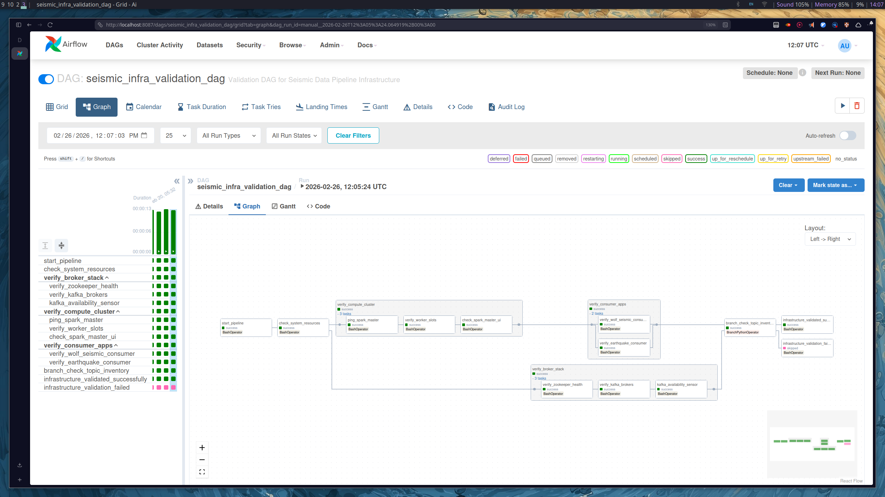
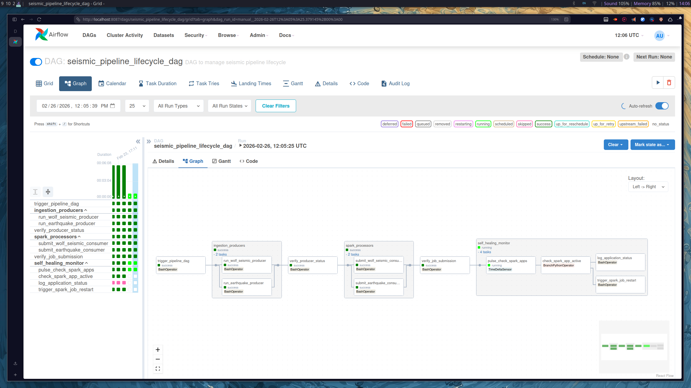

# dags — Airflow Orchestration

This directory contains the Apache Airflow DAGs that orchestrate the entire seismic data pipeline, from pre-flight infrastructure validation through continuous self-healing operation.

---

## DAGs Overview

| DAG File | DAG ID | Purpose | Trigger |
|---|---|---|---|
| `seismic_infra_validation_dag.py` | `seismic_infra_validation_dag` | Pre-flight health check of all infrastructure | Manual |
| `airport_batch_dag.py` | `airport_batch_dag` | Load airport CSV reference data into Delta Lake | Manual |
| `seismic_pipeline_lifecycle_dag.py` | `seismic_pipeline_lifecycle_dag` | Start producers/consumers and self-heal on failure | Manual |
| `pipeline_verification_dag.py` | `pipeline_verification_dag` | End-to-end run and data persistence validation | Manual |

> All DAGs use `schedule_interval=None` — they are **manually triggered** only.

---

## Recommended Execution Order

```
1. seismic_infra_validation_dag   →  confirm all services are healthy
          ↓
2. airport_batch_dag              →  airports Delta table created
          ↓
3. seismic_pipeline_lifecycle_dag →  producers + consumers running, self-heal active
          ↓
4. pipeline_verification_dag      →  (optional) end-to-end data flow validation
```

---

## seismic_infra_validation_dag.py

### Purpose
Runs a comprehensive pre-flight check on all infrastructure components before allowing the pipeline to start. Prevents data loss and runtime failures by catching broken dependencies early.

### Default Args
| Setting | Value |
|---|---|
| `retries` | 3 |
| `retry_delay` | 1 minute |
| `start_date` | 2025-12-17 |
### Dag



### Task Flow

```
start_pipeline  (BashOperator)
    └── scripts/start_pipeline.sh
          │
check_system_resources  (BashOperator)
    └── scripts/check_system_resources.sh
          │
          ├── verify_broker_stack  (TaskGroup)
          │     │
          │     ├── verify_zookeeper_health       socket connect → zookeeper:2181
          │     ├── verify_kafka_brokers          socket connect → kafka:9092
          │     └── kafka_availability_sensor     scripts/run_kafka_check.sh (timeout 15s)
          │
          └── verify_compute_cluster  (TaskGroup)
                │
                ├── ping_spark_master             socket connect → spark-master:7077
                ├── verify_worker_slots           curl spark-master:8080/json/ → grep 'workers'
                └── check_spark_master_ui         curl -f spark-master:8080
                      │
                      └── verify_consumer_apps  (TaskGroup)
                            ├── verify_wolf_seismic_consumer     grep 'WolfSeismicConsumer'
                            └── verify_earthquake_consumer       grep 'EarthquakeStreamProcessor'
                                  │
                                  └── branch_check_topic_inventory  (BranchPythonOperator)
                                        │
                                        ├── infrastructure_validated_successfully  → echo + exit 0
                                        └── infrastructure_validation_failed       → echo + exit 1
```

### Branch Logic — `check_topic_inventory()`
Checks that both required Kafka topics exist: `wolf_seismic_stream` and `earthquake_raw`.
- If both present → routes to `infrastructure_validated_successfully`
- If any missing → routes to `infrastructure_validation_failed`

> ⚠️ **TODO:** The topic inventory check currently uses a hardcoded set. Implement a live Kafka metadata query to make this check real.

### Environment Variables Used

| Variable | Default | Description |
|---|---|---|
| `ZOOKEEPER_HOST` | `zookeeper` | Zookeeper hostname |
| `ZOOKEEPER_CLIENT_PORT` | `2181` | Zookeeper port |
| `KAFKA_HOST` | `kafka` | Kafka broker hostname |
| `KAFKA_INTERNAL_PORT` | `9092` | Kafka broker port |
| `SPARK_MASTER_CONTAINER` | `spark-master` | Spark master container name |
| `SPARK_MASTER_PORT` | `7077` | Spark master port |
| `SPARK_MASTER_WEBUI_PORT` | `8080` | Spark Web UI port |

---

## airport_batch_dag.py

### Purpose
Orchestrates the batch load of airport CSV reference data into a Delta Lake table, creating the static dataset the proximity analyzer needs to calculate earthquake-to-airport distances.

### Default Args
| Setting | Value |
|---|---|
| `retries` | 1 |
| `retry_delay` | 2 minutes |
| `start_date` | 2026-01-12 |

### Task Flow

```
check_spark_master  (PythonOperator)
    └── check_spark_container()
        docker ps --filter name=spark-master → verify container is running
          │
run_airport_batch  (BashOperator)
    └── scripts/run_airport_batch.sh
        ├── Validates CSV file exists
        ├── Checks Spark container is running
        ├── docker cp "$CSV_LOCAL" spark-master:/opt/spark/work-dir/airports.csv
        └── spark-submit --conf spark.sql.extensions=io.delta.sql.DeltaSparkSession...
              airport_batch_to_delta.py
          │
verify_delta_table  (BashOperator)
    └── Checks if /opt/airflow/data/delta_airports directory exists
        ├── exists     → echo success, exit 0
        └── not found  → echo failure, exit 1
```

### Notes
- `check_spark_container()` uses `docker ps --filter name=spark-master` to confirm the container is up before any job submission.
- Delta table output is verified by checking the path `/opt/airflow/data/delta_airports`.

---

## seismic_pipeline_lifecycle_dag.py

### Purpose
Manages the full lifecycle of the seismic pipeline — starting both data producers and both Spark consumers in the correct order, verifying health at each stage, then running a continuous **self-healing monitor** that automatically restarts failed Spark jobs.

### Default Args
| Setting | Value |
|---|---|
| `retries` | 3 |
| `retry_delay` | 1 minute |
| `start_date` | 2025-12-17 |

### Dag



### Task Flow

```
trigger_pipeline_dag  (BashOperator)
    └── scripts/start_pipeline.sh
          │
ingestion_producers  (TaskGroup) ← parallel
    ├── run_wolf_seismic_producer    scripts/run_wolf_seismic_producer.sh
    └── run_earthquake_producer      scripts/run_earthquake_producer.sh
          │
verify_producer_status  (BashOperator)
    └── scripts/verify_producer_status.sh
          │
spark_processors  (TaskGroup) ← parallel
    ├── submit_wolf_seismic_consumer     scripts/submit_wolf_seismic_consumer.sh
    └── submit_earthquake_consumer       scripts/submit_earthquake_consumer.sh
          │
verify_job_submission  (BashOperator)
    └── scripts/verify_job_submission.sh
          │
self_healing_monitor  (TaskGroup)
    │
    ├── pulse_check_spark_apps  (TimeDeltaSensor)
    │       delta = 5 minutes
    │
    └── check_spark_app_active  (BranchPythonOperator)
            └── check_spark_app_health()
                curl spark-master:8080/json/ → inspect activeapps
                checks for: WolfSeismicConsumer, EarthquakeStreamProcessor
                    │
                    ├── both found   → log_application_status
                    │                  echo 'All Spark applications healthy'
                    │
                    └── any missing  → trigger_spark_job_restart
                                       scripts/restart_spark_jobs.sh
```

### Self-Healing Logic — `check_spark_app_health()`
Queries the Spark Master REST API (`GET /json/`) every 5 minutes and inspects the `activeapps` list for the two expected application names. Any missing app triggers an automatic restart.

```python
app_names = ["WolfSeismicConsumer", "EarthquakeStreamProcessor"]
# len(found_apps) >= 2  →  log_application_status
# otherwise             →  trigger_spark_job_restart
```

Failure modes that trigger a restart: Spark Master unreachable, JSON parse error, either app not in `activeapps`.

### Scripts Referenced

| Script | Called By |
|---|---|
| `scripts/start_pipeline.sh` | `trigger_pipeline_dag` |
| `scripts/run_wolf_seismic_producer.sh` | `run_wolf_seismic_producer` |
| `scripts/run_earthquake_producer.sh` | `run_earthquake_producer` |
| `scripts/verify_producer_status.sh` | `verify_producer_status` |
| `scripts/submit_wolf_seismic_consumer.sh` | `submit_wolf_seismic_consumer` |
| `scripts/submit_earthquake_consumer.sh` | `submit_earthquake_consumer` |
| `scripts/verify_job_submission.sh` | `verify_job_submission` |
| `scripts/restart_spark_jobs.sh` | `trigger_spark_job_restart` |

---

## pipeline_verification_dag.py

### Purpose
Runs the full pipeline end-to-end and validates that data is persisted correctly across all Delta Lake tables. Useful for integration testing and confirming a fresh environment is working correctly.

### Default Args
| Setting | Value |
|---|---|
| `retries` | 1 |
| `start_date` | 2026-02-20 |

### Task Flow

```
[start_earthquake_producer, start_wolf_producer]  ← parallel
    ├── scripts/run_earthquake_producer.sh
    └── scripts/run_wolf_seismic_producer.sh
          │
wait_for_producers  (TimeDeltaSensor)  →  30 seconds
          │
[start_earthquake_consumer, start_wolf_consumer]  ← parallel
    ├── scripts/submit_earthquake_consumer.sh
    └── scripts/submit_wolf_seismic_consumer.sh
          │
wait_for_consumers  (TimeDeltaSensor)  →  1 minute
          │
start_proximity_analyzer  (BashOperator)
    └── scripts/run_proximity_analyzer.sh
          │
wait_for_analyzer  (TimeDeltaSensor)  →  1 minute
          │
run_validation  (BashOperator)
    └── docker exec spark-master spark-submit
          --packages io.delta:delta-spark_2.12:3.0.0
          --conf spark.sql.extensions=io.delta.sql.DeltaSparkSessionExtension
          --conf spark.sql.catalog.spark_catalog=...DeltaCatalog
          /opt/spark/scripts/validate_delta_tables.py
```

### Wait Timings

| Sensor | Wait | Reason |
|---|---|---|
| `wait_for_producers` | 30 seconds | Allow producers to establish WebSocket connections and begin publishing |
| `wait_for_consumers` | 1 minute | Allow Spark consumers to initialize and write first records to Delta |
| `wait_for_analyzer` | 1 minute | Allow proximity analyzer to complete at least one processing batch |

---

## Shared Environment Variables

| Variable | Default | Used By |
|---|---|---|
| `SPARK_MASTER_CONTAINER` | `spark-master` | All DAGs |
| `SPARK_MASTER_PORT` | `7077` | Infra validation, lifecycle |
| `SPARK_MASTER_WEBUI_PORT` | `8080` | Infra validation, lifecycle |
| `ZOOKEEPER_HOST` | `zookeeper` | Infra validation |
| `ZOOKEEPER_CLIENT_PORT` | `2181` | Infra validation |
| `KAFKA_HOST` | `kafka` | Infra validation |
| `KAFKA_INTERNAL_PORT` | `9092` | Infra validation |